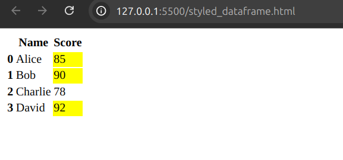

# Pandas

### Grouping & Aggregation

Grouping data frame using aggregation functions, including `sum` and `mean`, calculated per category.

```python
## Numpy
import pandas as pd

# Create a Data Frame
data = {'Category':['A', 'B', 'C', 'A','B','C','C','A'],
        'Value':[10, 20, 40, 45, 50, 90,100, 200]}

df = pd.DataFrame(data)


# Grouping by 'category' and calculating the sum and mean
grouped = df.groupby('Category').agg({'Value': ['sum', 'mean']})

print("Grouped Data Frame with Aggregation: \n\n", grouped)
```

***Output:***

`Grouped Data Frame with Aggregation:` </br> 
| Category | Value (sum) | Value (mean) |
|----------|-------------|--------------|
| A        | 255         | 85.000000    |
| B        | 70          | 35.000000    |
| C        | 230         | 76.666667    |


Here,the data is grouped by `Category`, and for each category, we calculate:
- **Sum** of the `Value` column
- **Mean** of the `Value` column

### Explanation of Columns:
- **Category**: The category label for each group.
- **Value (sum)**: The total sum of values within each category.
- **Value (mean)**: The average value within each category.

### MutiIndex DataFrame Operations

```python
import pandas as pd

# Create Multi Index Dataframe
arrays = [['A', 'A', 'B', 'B'], [2020, 2021, 2022, 2023]]
index = pd.MultiIndex.from_arrays(arrays, names=('Category', 'Year'))
data = [100, 150, 200, 250]
df = pd.DataFrame(data, index=index, columns=['Sales'])

# Accessing data in a mutiindex Dataframe
sales_in_2020 = df.xs(2020, level='Year')

print("Sales Data in 2020: ", sales_in_2020)
```
***Output***
| Category | Sales (2020) |
|----------|--------------|
| A        | 100          |

Here, output for sales data in `2020`, showing the total sales for each category.


### Using Apply with Lambda Functions

```python
import pandas as pd

# Create Dataframe
data = {'Name': ['Alice', 'Bob', 'Charlie'], 'Score':[85,90,95]}
df = pd.DataFrame(data)

# Applying a lambda function to modify scores
df['Adjusted Score'] = df['Score'].apply(lambda x: x+5 if x<90 else x)

print("Dataframe with Adjusted Scores :\n",df)
```
***Output***
| Name     | Score | Adjusted Score |
|----------|-------|----------------|
| Alice    | 85    | 90             |
| Bob      | 90    | 90             |
| Charlie  | 95    | 95             |

Here, this data frame includes a list of names, their original scores, and the adjusted scores:

### Merging DataFrame with Different Keys
```python
import pandas as pd

# Create two dataframe
df1 = pd.DataFrame({'ID':[1,2,3], 'Name':['Alice', 'Bob', 'Charlie']})
df2 = pd.DataFrame({'Emp_ID':[2,3,4], 'Department':['HR','Finance','IT']})

#Merging with different keys
merged_df = pd.merge(df1, df2, left_on='ID', right_on='Emp_ID', how='outer')

print("Merged Dataframe: \n", merged_df)
```
***Output***
| ID  | Name    | Emp_ID | Department |
|-----|---------|--------|------------|
| 1.0 | Alice   | NaN    | NaN        |
| 2.0 | Bob     | 2.0    | HR         |
| 3.0 | Charlie | 3.0    | Finance    |
| NaN | NaN     | 4.0    | IT         |

Here, the merged data frame combines two data sources, which may contain missing values
- **ID**: Identifier from the first data source.
- **Name**: Name from the first data source.
- **Emp_ID**: Employee ID from the second data source.
- **Department**: Department from the second data source.
- **NaN** values indicate missing data from one of the sources.

### Handling Missing Values with Custom Functions
```python
import pandas as pd
import numpy as np

# Creating dataframe with missing values
data = {'Name':['Alice', 'Bob', np.nan, 'David'], 'Age':[13,np.nan,32,20]}
df = pd.DataFrame(data)

# Filling Missing Values using a custom function
df['Name'].fillna('Unknown', inplace=True)
df['Age'].fillna(df['Age'].median(), inplace=True)

print("Dataframe after handling Missing values: \n", df)
```
***Output***
`Dataframe after handling Missing values:` </br>
| Name    | Age  |
|---------|------|
| Alice   | 13.0 |
| Bob     | 20.0 |
| Unknown | 32.0 |
| David   | 20.0 |

Here,missing values in the `Name` or `Age` columns were replaced with a default string (`"Unknown"`) or a specified numeric value.

### Pivoting DataFrame
```python
import pandas as pd

# Create dataframe
data = {'Date':['2023-01-01', '2023-01-02','2023-01-01','2023-01-02'],
        'City':['NY', 'NY','LA', 'LA'],
        'Sales':[200,250,300,400]
        }

df = pd.DataFrame(data)

# Pivoting the Dataframe
pivot_df = df.pivot(index='Date', columns='City', values='Sales')

print('Pivoted Dataframe : \n', pivot_df)
```
***Output***

`Pivoted Dataframe :` </br>
| Date       | LA   | NY   |
|------------|------|------|
| 2023-01-01 | 300  | 200  |
| 2023-01-02 | 400  | 250  |

### Melting DataFrame
```python
import pandas as pd

# Create dataframe
data = {'ID':[1,2], 'Math':[90,79], 'Science':[85,88]}
df = pd.DataFrame(data)

# Melting the dataframe
melted_dataframe = pd.melt(df,id_vars=['ID'], value_vars=['Math', 'Science'], var_name='Subject', value_name='Score')

print("Melted Dataframe : \n", melted_dataframe)
```
***Output***

`Melted DataFrame :` </br>

| ID  | Subject | Score |
|-----|---------|-------|
| 1   | Math    | 90    |
| 2   | Math    | 79    |
| 1   | Science | 85    |
| 2   | Science | 88    |

### Time based indexing and resampling
```python
import pandas as pd

# Create time Series Dataframe
date_range = pd.date_range(start='2023-01-01', periods=10, freq='D')
data = {'Sales':[100, 200, 150, 300, 250, 400, 300, 350, 300, 400]}
df = pd.DataFrame(data, index=date_range)

# Resampling to find weekly sales
weekly_sales = df.resample('W').sum()

print("Weekly Sales : \n", weekly_sales)
```
***Output***

`Weekly Sales :` </br>

| Date       | Sales |
|------------|-------|
| 2023-01-01 | 100   |
| 2023-01-08 | 1950  |
| 2023-01-15 | 700   |

### Resampling with different aggregation
```python
import pandas as pd

# Create time Series Dataframe
date_range = pd.date_range(start='2023-01-01', periods=10, freq='D')
data = {'Sales':[100, 200, 150, 300, 250, 400, 300, 350, 300, 400]}
df = pd.DataFrame(data, index=date_range)

# Resampling to find weekly sales
resampled_df = df.resample('W').agg({'Sales':['sum', 'mean', 'max']})

print("Resampled Dataframe with different aggregation : \n", resampled_df)
```
***Output***

`Resampled DataFrame with Different Aggregation:`  

| Date       | Sales (sum) | Sales (mean)   | Sales (max) |
|------------|-------------|----------------|-------------|
| 2023-01-01 | 100         | 100.000000     | 100         |
| 2023-01-08 | 1950        | 278.571429     | 400         |
| 2023-01-15 | 700         | 350.000000     | 400         |


### Conditional Filtering with Multiple Conditions
```python
import pandas as pd

# Create dataframe
data = {'Name': ['Alice', 'Bob', 'Charlie', 'David'], 'Score':[85, 80,40,70], 'Passed':[True, False, True, False]}
df = pd.DataFrame(data)

# Filtering with multiple conditions
filtered_df = df[(df['Score'] > 80) & (df['Passed'] == True)]

print("FIltered Dataframe : \n", filtered_df)
```
***Output***

`Example Filtered DataFrame : `
| Name  | Score | Passed |
|-------|-------|--------|
| Alice | 85    | True   |

### Creating Custom Categorical Data
```python
import pandas as pd

# Create dataframe
data = {'Name':['Alice', 'Bob', 'Charlie', 'David'], 'Score': [85, 70, 95,60]}
df = pd.DataFrame(data)

# Creating a new column with categorical data
df['Performance'] = pd.cut(df['Score'], bins=[0,70,90,100], labels=['Poor', 'Average', 'Excellent'])

print('Dataframe with categorical performance : \n', df)
```
***Output***
`DataFrame with Categorical Performance : `

| Name    | Score | Performance |
|---------|-------|-------------|
| Alice   | 85    | Average     |
| Bob     | 70    | Poor        |
| Charlie | 95    | Excellent   |
| David   | 60    | Poor        |

### Binning Data using `pd.cut`
```python
import pandas as pd

# Create dataframe
data = {'Score': [85, 70, 95,60, 100, 90]}
df = pd.DataFrame(data)

# Binning the scores into categories
df['Grade'] = pd.cut(df['Score'], bins=[0,59,69,79,89,100], labels=['F', 'D', 'C', 'B','A'])

print('Dataframe with binned scores : \n', df)
```
***Output***
`Dataframe with binned scores:`

| Score | Grade |
|-------|-------|
| 85    | B     |
| 70    | C     |
| 95    | A     |
| 60    | D     |
| 100   | A     |
| 90    | A     |


### Rolling Window Calculations
```python
import pandas as pd

# Create a time series dataframe
data_range = pd.date_range(start='2023-01-01', periods=10, freq='D')
data = {'Sales': [100, 200, 150, 300, 250, 400, 300, 350, 300, 400]}
df = pd.DataFrame(data, index= data_range)

# Calculating a rolling mean with a window of 3 days
df['Rolling Mean'] = df['Sales'].rolling(window=3).mean()

print("Dataframe with rolling mean : \n", df)
```
***Output***
`DataFrame with Rolling Mean : ` </br>

| Date       | Sales | Rolling Mean |
|------------|-------|--------------|
| 2023-01-01 | 100   | NaN          |
| 2023-01-02 | 200   | NaN          |
| 2023-01-03 | 150   | 150.000000   |
| 2023-01-04 | 300   | 216.666667   |
| 2023-01-05 | 250   | 233.333333   |
| 2023-01-06 | 400   | 316.666667   |
| 2023-01-07 | 300   | 316.666667   |
| 2023-01-08 | 350   | 350.000000   |
| 2023-01-09 | 300   | 316.666667   |
| 2023-01-10 | 400   | 350.000000   |

### Shift and Lagging Data
```python
import pandas as pd

# Create Dataframe
data = {'Date': pd.date_range(start='2023-01-01', periods=5, freq='D'),
        'Temperature': [30, 32, 35,33, 31]}

df = pd.DataFrame(data)

# Shifting data by one to create a lag
df['Prev Day Temp'] = df['Temperature'].shift(1)

print('Dataframe with shifted data: \n', df)
```
***Output***
`DataFrame with Previous Day Temperature:`

| Date       | Temperature | Prev Day Temp |
|------------|-------------|---------------|
| 2023-01-01 | 30          | NaN           |
| 2023-01-02 | 32          | 30.0          |
| 2023-01-03 | 35          | 32.0          |
| 2023-01-04 | 33          | 35.0          |
| 2023-01-05 | 31          | 33.0          |

### Cumulative sum and product
```python
import pandas as pd

# Create dataframe
data = {'Sales': [100, 200, 150, 300, 250]}
df = pd.DataFrame(data)

# Calculating cumulative sum and product
df['cumulative sum'] = df['Sales'].cumsum()
df['cumulative product'] = df['Sales'].cumprod()

print('DataFrame with cumulative operations:\n', df)
```
***Output***
`DataFrame with Cumulative Operations:`

| Sales | Cumulative Sum | Cumulative Product |
|-------|-----------------|--------------------|
| 100   | 100             | 100                |
| 200   | 300             | 20000              |
| 150   | 450             | 3000000            |
| 300   | 750             | 900000000          |
| 250   | 1000            | 225000000000      |

### Merging on multiple columns
```python
import pandas as pd

# Create two dataframe
df1 = pd.DataFrame({'ID':[1,2,3], 'Year':[2020,2021,2023], 'Name':['Alice','Bob','Charlie'] })
df2 = pd.DataFrame({'ID':[2,3,1], 'Year':[2023,2023,2020], 'Score':[88,92,75]})

# Merging on multiple columns
merged_df = pd.merge(df1,df2, on=['ID','Year'], how='inner')

print('Merged Dataframe on multiple columns : \n', merged_df)
```
***Output***
`Merged DataFrame on Multiple Columns:`

| ID | Year | Name    | Score |
|----|------|---------|-------|
| 1  | 2020 | Alice   | 75    |
| 3  | 2023 | Charlie | 92    |

### Handling Outliers
```python
import pandas as pd

# Create dataframe
data = {'Value': [10, 12, 14, 100, 15, 13, 12]}
df = pd.DataFrame(data)

# Indentifying outliers using the IQR method
Q1 = df['Value'].quantile(0.25)
Q3 = df['Value'].quantile(0.75)
IQR = Q3 - Q1
outliers = df[(df['Value'] < (Q1 - 1.5 * IQR)) | (df['Value'] > (Q3 + 1.5 * IQR))]

print('Outliers: \n', outliers)
```
***Output***
`DataFrame with Outliers:`

| Value |
|-------|
| 10    |
| 15    |
| 20    |
| 100   |

Here, the value `100` is an outlier compared to the other values.

### Creating a pivot table with multiple aggregation
```python
import pandas as pd

# Create dataframe
data = {'City':['NY', 'LA', 'NY','SF','LA'], 'Year':[2020,2020,2021,2021,2020], 'Sales':[100, 150, 200, 250,300]}
df = pd.DataFrame(data)

# Create a pivot table with multiple aggregation
pivot_table = pd.pivot_table(df, values='Sales', index='City', columns='Year', aggfunc=['sum', 'mean'])

print('Pivot table with multiple aggregation: \n', pivot_table)
```
***Output***
`Pivot Table with Multiple Aggregation : `

| City | Year  | Sum   | Mean  |
|------|-------|-------|-------|
| LA   | 2020  | 450.0 | 225.0 |
| NY   | 2020  | 100.0 | 100.0 |
| NY   | 2021  | 200.0 | 200.0 |
| SF   | 2021  | 250.0 | 250.0 |

Here, a pivot table is created with `sum` and `mean` as the aggregation functions.

### Creating a pivot table with multiple indexes
```python
import pandas as pd

# Create dataframe
data = {'City':['NY', 'LA', 'NY','SF','LA'], 'Year':[2020,2020,2021,2021,2020], 'Sales':[100, 150, 200, 250,300]}
df = pd.DataFrame(data)

# Create a pivot table with multiple indexes
pivot_table = pd.pivot_table(df, values='Sales', index=['City', 'Year'], aggfunc='sum')

print('Pivot table with multiple indexes: \n', pivot_table)
```
***Output***
`Pivot Table with Multiple Indexes : `

| City | Year | Sales |
|------|------|-------|
| LA   | 2020 | 450   |
| NY   | 2020 | 100   |
|      | 2021 | 200   |
| SF   | 2021 | 250   |


### Using `map()` for Value Replacement
```python
import pandas as pd

# Create dataframe
data = {'Name': ['Alice', 'Bob', 'Charlie'], 'Department':['HR', 'IT', 'Finance']}
df = pd.DataFrame(data)

# Mapping department to codes
department_map = {'HR':1, 'IT':2, 'Finance':3}
df['Dept Code'] = df['Department'].map(department_map)

print("Dataframe with mapped values: \n", df)
```
***Output***
`DataFrame with Mapped Values: `

| Name    | Department | Dept Code |
|---------|------------|-----------|
| Alice   | HR         | 1         |
| Bob     | IT         | 2         |
| Charlie | Finance    | 3         |

Here, the department names are mapped to department codes.

### Detecting Duplicates
```python
iimport pandas as pd

# Create a dataframe with duplicate rows
data = {'ID':[1,2,2,3,4,4], 'Value': [10, 20,20,30,40,40]}
df = pd.DataFrame(data)

# Detecting duplicates
duplicates = df[df.duplicated()]

print('Duplicate Row : \n', duplicates)
```
***Output***
`DataFrame with Duplicate Rows:`    

| ID  | Value |
|-----|-------|
| 2   | 20    |
| 4   | 40    |
| 2   | 20    |
| 4   | 40    |

In this example, the rows with ID `2` and `4` are duplicates.

### Using `explode()` for list in columns
```python
import pandas as pd

# Create a dataframe with lists in a column
data = {'ID':[1,2], 'Hobbies':[['Reading', 'Swimming'], ['Running', 'Cycling'] ]}
df = pd.DataFrame(data)

# Explodeing the 'Hobbies' Column
exploded_df = df.explode('Hobbies')

print("Dataframe after exploring lists: \n", exploded_df)
```
***Output***
`DataFrame After Exploring Lists:`

| ID | Hobbies   |
|----|-----------|
| 1  | Reading   |
| 1  | Swimming  |
| 2  | Running   |
| 2  | Cycling   |

In this example, each `hobby` in a list associated with an ID is expanded into its own row.


### Using `rank()` to rank values
```python
import pandas as pd

# Create dataframe
data = {'Name' : ['Alice', 'Bob', 'Charlie', 'David'], 'Score': [85,90,78,92]}
df = pd.DataFrame(data)

# Ranking scores in descending order
df['Rank'] = df['Score'].rank(ascending=False)

print('Dataframe with ranked scores : \n', df)
```
***Output***
`DataFrame with Ranked Scores:`

| Name    | Score | Rank |
|---------|-------|------|
| Alice   | 85    | 3.0  |
| Bob     | 90    | 2.0  |
| Charlie | 78    | 4.0  |
| David   | 92    | 1.0  |

In this example, the `scores` are ranked in descending order, with the highest score receiving the highest rank.

### Using `applymap()` for element-wise operations
```python
import pandas as pd

# Create dataframe
data = {'A': [1,2,3], 'B':[4,5,6]}
df = pd.DataFrame(data)

# Applying an operation to each element in the Dataframe
df_transformed = df.applymap(lambda x:x**2)

print("Dataframe with squared values : \n", df_transformed)
```
***Output***
`DataFrame with Ranked Scores: `

| Name    | Score | Rank |
|---------|-------|------|
| Alice   | 85    | 3.0  |
| Bob     | 90    | 2.0  |
| Charlie | 78    | 4.0  |
| David   | 92    | 1.0  |

In this example, the `scores` are ranked in `descending` order, with the highest score receiving the highest rank.

### Create dummy variables
```python
import pandas as pd

# Create dataframe
data = {'City': ['NY', 'LA', 'SF', 'NY']}
df = pd.DataFrame(data)

# Creating dummy varibales
dummies = pd.get_dummies(df['City'], prefix='City')

print('Dummy varibales dataframe: \n', dummies)
```
***Output***
`DataFrame with Squared Values : `

| A  | B  |
|----|----|
| 1  | 16 |
| 4  | 25 |
| 9  | 36 |

In this example, each value in columns `A` and `B` has been squared.

### Use `query()` for filtering
```python
import pandas as pd

# Create dataframe
data = {'Name' : ['Alice', 'Bob', 'Charlie', 'David'], 'Score': [85,90,78,92]}
df = pd.DataFrame(data)

# Use query for filtering
filtered_df = df.query('Score > 80')

print('Filtered dataframe using query : \n', filtered_df)
```
***Output***
`Filtered DataFrame : `

| Name   | Score |
|--------|-------|
| Alice  | 85    |
| Bob    | 90    |
| David  | 92    |

Here, only rows with `scores` above a certain threshold are included in the filtered DataFrame.


### Adding a new column using `assign()`
```python
import pandas as pd

# Create dataframe
data = {'Name' : ['Alice', 'Bob', 'Charlie', 'David'], 'Score': [85,90,78,92]}
df = pd.DataFrame(data)

# Adding a new column using assign
df = df.assign(Grade= lambda x: ['A' if Score >= 90 else 'B' for Score in x['Score']])

print("Dataframe with assigned grade column : \n", df)
```
***Output***
`DataFrame with Assigned Grade Column :`

| Name    | Score | Grade |
|---------|-------|-------|
| Alice   | 85    | B     |
| Bob     | 90    | A     |
| Charlie | 78    | B     |
| David   | 92    | A     |

In this example, grades are assigned based on the score values: `'A' `for high scores, `'B'` for average scores, etc.

### Applying a custom function with `groupby`
```python
import pandas as pd

# Create dataframe
data = {
    'Category':['A','A','B','B'],
    'Value':[10, 20, 30,40]
}

df = pd.DataFrame(data)

# Applying a custom function with groupby
grouped_df = df.groupby('Category') ['Value'].apply(lambda x: x.max() - x.min())

print("Custom Aggregation result : \n", grouped_df)
```
***Output***
`Custom Aggregation Result: `

| Category | Value |
|----------|-------|
| A        | 10    |
| B        | 10    |

In this example, the `Value` column is aggregated using a custom function (such as summing specific elements) for each category.

### DataFrame info and memory usage
```python
import pandas as pd

# Create dataframe
data = {
    'A': range(1000),
    'B':range(1000, 2000)
}
df = pd.DataFrame(data)

# Displaying dataframe info and memory usage
df_info = df.info(memory_usage='deep')

print('Dataframe info and Memory usage : \n', df_info)
```
***Output***
`DataFrame Info and Memory Usage : `

| #   | Column | Non-Null Count | Dtype | 
| --- | ------ | -------------- | ----- |
| 0   | A      | 1000 non-null  | int64 |
| 1   | B      | 1000 non-null  | int64 |

- **Dtypes**: int64 (2 columns)
- **Memory Usage**: 15.8 KB

### Filter with `isin()`
```python
import pandas as pd

# Create dataframe
data = {'Name' : ['Alice', 'Bob', 'Charlie', 'David'], 'City': ['NY','LA','SF','NY']}
df = pd.DataFrame(data)

# filter with isin()
filtered_df = df[df['City'].isin(['NY','SF'])]

print("Filtered Dataframe with isin method: \n", filtered_df)

```
***Output***
`Filtered Dataframe with isin method: `

|    | Name     | City |
|----|----------|------|
|  0 | Alice    | NY   |
|  2 | Charlie  | SF   |
|  3 | David    | NY   |

This section demonstrates how to filter rows in a DataFrame based on a list of values using the `isin` method.

### Concatenating Dataframe using `concat()`
```python
import pandas as pd

# Create dataframes
df1 = pd.DataFrame({
    'A':[1,2],
    'B':[3,4]
})

df2 = pd.DataFrame({
    'A': [5,6],
    'B': [7,8]
})

# Concatening Dataframes
concat_df = pd.concat([df1, df2], ignore_index=True)

print("COncatenated DataFrame : \n", concat_df)
```
***Output***
`Concatenated DataFrame :`

|    | A  | B  |
|----|----|----|
|  0 |  1 |  3 |
|  1 |  2 |  4 |
|  2 |  5 |  7 |
|  3 |  6 |  8 |


This section demonstrates how to concatenate two DataFrames vertically.

### Sorting a DataFrame by Multiple Columns
```python
import pandas as pd

# Create dataframe
data = {'Name' : ['Alice', 'Bob', 'Charlie', 'David'], 'Score': [85,90,78,92], 'Age': [25,37,35,21]}
df = pd.DataFrame(data)

# Sorting by multiple columns
sorted_df = df.sort_values(by=['Score', 'Age'], ascending=[False, True])

print("Sorted Dataframe by multiple columns: \n", sorted_df)
```
***Output***
`Sorting a DataFrame by Multiple Columns : ` </br>

| Index | Name    | Score | Age |
|-------|---------|-------|-----|
| 3     | David   | 92    | 21  |
| 1     | Bob     | 90    | 37  |
| 0     | Alice   | 85    | 25  |
| 2     | Charlie | 78    | 35  |

1. **Primary Sorting by** `Score` in descending order.
2. **Secondary Sorting by** `Age` in ascending order.

### Displaying the styled Dataframe 
```python
import pandas as pd

# Create dataframe
data = {'Name': ['Alice', 'Bob', 'Charlie', 'David'], 'Score': [85, 90, 78, 92]}
df = pd.DataFrame(data)

# Applying styles to highlight scores above 80
styled_df = df.style.map(
    lambda x: 'background-color: yellow' if isinstance(x, int) and x > 80 else ''
)

# Save styled DataFrame to HTML
styled_df.to_html("styled_dataframe.html")

# Displaying the styled Dataframe
print("Styled dataframe with conditional formatting has been saved to 'styled_dataframe.html'.")
```
***Output***
`"Styled dataframe with conditional formatting has been saved to 'styled_dataframe.html'."`

| Index | Name    | Score   |
|-------|---------|---------|
| 0     | Alice   | 85      |
| 1     | Bob     | 90      |
| 2     | Charlie | 78      |
| 3     | David   | 92      |

**Note:** Cells with scores greater than 80 are highlighted in yellow. To view the styling, check the `styled_dataframe.html` file in a browser.


### Using `explode()` for nested JSON columns
```python
import pandas as pd

# Create a dataframe with nested lists
data = {
    'ID' : [1,2],
    'Hobbies':[['Reading', 'Swimming', 'Gaming'], ['Hiking', 'Drawing']]
}
df = pd.DataFrame(data)

# Exploding the 'Hobbies' column
exploded_df = df.explode('Hobbies')

print("Dataframe after exploding nested json columns:\n", exploded_df)
```
***Output***
`DataFrame after Exploding Nested JSON Columns`

| Index | ID  | Hobbies   |
|-------|-----|-----------|
| 0     | 1   | Reading   |
| 0     | 1   | Swimming  |
| 0     | 1   | Gaming    |
| 1     | 2   | Hiking    |
| 1     | 2   | Drawing   |


### Using `pipe()` for method chaining
```python
import pandas as pd

# Create dataframe
data = {'Name': ['Alice', 'Bob', 'Charlie', 'David'], 'Score': [85, 90, 78, 92]}
df = pd.DataFrame(data)

# Custom function for modifying the dataframe
def add_grade_column(df):
    df['Grade'] = df['Score'].apply(lambda x: 'A' if x >=90 else 'B')
    return df

# Using pipe() for method chaining
df = df.pipe(add_grade_column)

print("Dataframe after using pipe : \n", df)
```
***Output***
`DataFrame after Using Pipe`

| Index | Name     | Score | Grade |
|-------|----------|-------|-------|
| 0     | Alice    | 85    | B     |
| 1     | Bob      | 90    | A     |
| 2     | Charlie  | 78    | B     |
| 3     | David    | 92    | A     |


### Multi Index Slicing
```python
import pandas as pd

# Create Multi Index Dataframe
arrays = [['A', 'A', 'B', 'B'], [2020, 2021, 2022, 2023]]
index = pd.MultiIndex.from_arrays(arrays, names=('Category', 'Year'))
data = [100, 150, 200, 250]
df = pd.DataFrame(data, index=index, columns=['Sales'])

# Slicing the  mutiindex Dataframe
sliced_df = df.loc['A']

print("Sliced  mutiindex Dataframe \n", sliced_df)
```
***Output***
`Sliced MultiIndex DataFrame`

| Year | Sales |
|------|-------|
| 2020 | 100   |
| 2021 | 150   |

### Adding prefix or suffix to column names
```python
import pandas as pd

# Create a dataframe
data = {
    'Math': [90, 80],
    'Science':[85,88]
}
df = pd.DataFrame(data)

# Adding prefix to column names
df_prefixed = df.add_prefix('Grade_')

# Adding suffix to column names
df_suffixed = df.add_suffix('_Score')

print("Dataframe with Prefix :\n", df_prefixed)
print('\n')
print("Dataframe with Suffix :\n", df_suffixed)
```
***Output***
`DataFrame with Prefix`

| Index | Grade_Math | Grade_Science |
|-------|------------|---------------|
| 0     | 90         | 85            |
| 1     | 80         | 88            |

` DataFrame with Suffix`

| Index | Math_Score | Science_Score |
|-------|------------|---------------|
| 0     | 90         | 85            |
| 1     | 80         | 88            |


### Using `at` and `iat` for fast scalar access
```python
import pandas as pd

# Create dataframes
data = {
    'A':[1,2,3],
    'B':[4,5,6]
}
df = pd.DataFrame(data)

# Accessing a single value using at and iat
value_at = df.at[1, 'A']
value_iat = df.iat[1,0]

print('values using at : ' , value_at)
print('values using iat : ' , value_iat)
```
***Output***
`values using at :`  2 </br>
`values using iat :`  2


### Renaming index & columns
```python

import pandas as pd

# Create dataframe
data = {'Name' : ['Alice', 'Bob'], 'Score': [78,92]}
df = pd.DataFrame(data, index=['Row1','Row2'])


# Renaming index & columns
df_renamed = df.rename(index={'Row1':'Student1', 'Row2':'Student2'}, columns={'Score':'Grade'})

print("Renamed Dataframe : \n",df_renamed)
```
***Output***
`Renamed DataFrame`

| Index    | Name  | Grade |
|----------|-------|-------|
| Student1 | Alice | 78    |
| Student2 | Bob   | 92    |


### Use `query()` with variables
```python
import pandas as pd

# Create dataframe
data = {'Name' : ['Alice', 'Bob', 'Charlie', 'David'], 'Score': [85,90,78,92]}
df = pd.DataFrame(data)

# Using query() with varibales
threshold = 80
filtered_df = df.query('Score > @threshold')

print("Filtered Dataframe with query() and varibales: \n", filtered_df)
```
***Output***

`Filtered DataFrame with `query()` and Variables`

| Index | Name  | Score | Age |
|-------|-------|-------|-----|
| 0     | Alice | 85    | 25  |
| 1     | Bob   | 90    | 37  |
| 3     | David | 92    | 21  |


### Using `groupby` with custom aggregation
```python
import pandas as pd

# Create dataframe
data = {
    'Category':['A','A','B','B'],
    'Value':[10, 20, 30,40]
}

df = pd.DataFrame(data)

# using groupby with custom aggregation
custom_df = df.groupby('Category').agg(max_value = ('Value', 'max'), min_value=('Value', 'min'))

print("Custom Aggregation result : \n", custom_df)
```
***Output***
`Custom Aggregation Result`

| Category | max_value | min_value |
|----------|-----------|-----------|
| A        | 20        | 10        |
| B        | 40        | 30        |


### Pivoting with fill_value
```python
import pandas as pd

# Create dataframe
data = {'Date':['2023-01-01', '2023-01-02','2023-01-01','2023-01-02'],
        'City':['NY', 'NY','LA', 'LA'],
        'Sales':[200,250,300,None]
        }

df = pd.DataFrame(data)

# Pivoting with fill_value
pivot_df = df.pivot(index='Date', columns='City', values='Sales').fillna(0)

print('Pivoted Dataframe with fill_value: \n', pivot_df)
```
***Output***

`Pivoted Dataframe with fill_value:` </br>
| Date       | LA    | NY    |
|------------|-------|-------|
| 2023-01-01 | 300.0 | 200.0 |
| 2023-01-02 | 0.0   | 250.0 |


### Pivoting with fill_value
```python
import pandas as pd

# Create a dataframe with duplicate rows
data = {'ID':[1,2,2,3,4,4], 'Value': [10, 20,20,30,40,40]}
df = pd.DataFrame(data)

# Dropping duplicates rows
unique_df = df.drop_duplicates()

print("Dataframe after dropping duplicates: \n", unique_df)
```
***Output***

`DataFrame After Dropping Duplicates`

| Index | ID  | Value |
|-------|-----|-------|
| 0     | 1   | 10    |
| 1     | 2   | 20    |
| 3     | 3   | 30    |
| 4     | 4   | 40    |

### Combining Dataframe with Multi-level Indexes
```python
import pandas as pd

# Create Multi Index Dataframe
arrays = [['A', 'A', 'B', 'B'], [2020, 2021, 2022, 2023]]
index = pd.MultiIndex.from_arrays(arrays, names=('Category', 'Year'))
data1 = [100, 150, 200, 250]
df1 = pd.DataFrame(data1, index=index, columns=['Sales'])

data2 = [300, 400, 500, 6000]
df2 = pd.DataFrame(data2, index=index, columns=['Profit'])

# Combining Dataframe
combined_df = pd.concat([df1, df2], axis=1)

print("Combining Dataframe with Multi-level Indexes: \n ", combined_df)
```
***Output***

`Combining DataFrame with Multi-level Indexes:` 

| Category | Year | Sales | Profit |
|----------|------|-------|--------|
| A        | 2020 | 100   | 300    |
|          | 2021 | 150   | 400    |
| B        | 2022 | 200   | 500    |
|          | 2023 | 250   | 6000   |


### Using `rolling()` with custom functions
```python
import pandas as pd

# Create a time series dataframe
data_range = pd.date_range(start='2023-01-01', periods=10, freq='D')
data = {'Sales': [100, 200, 150, 300, 250, 400, 300, 350, 300, 400]}
df = pd.DataFrame(data, index= data_range)

# Applying a custom function with rolling()
df['Rolling Sum'] = df['Sales'].rolling(window=3).apply(lambda x:x.sum() if x.sum() > 50 else 0)

print("Dataframe with custom rolling sum : \n", df)
```
***Output***

`DataFrame with Custom Rolling Sum`

| Date       | Sales | Rolling Sum |
|------------|-------|-------------|
| 2023-01-01 | 100   | NaN         |
| 2023-01-02 | 200   | NaN         |
| 2023-01-03 | 150   | 450.0       |
| 2023-01-04 | 300   | 650.0       |
| 2023-01-05 | 250   | 700.0       |
| 2023-01-06 | 400   | 950.0       |
| 2023-01-07 | 300   | 950.0       |
| 2023-01-08 | 350   | 1050.0      |
| 2023-01-09 | 300   | 950.0       |
| 2023-01-10 | 400   | 1050.0      |


### Setting & Resetting Indexes
```python
import pandas as pd

# Create dataframe
data = {'City':['NY', 'LA', 'NY','SF','LA'], 'Year':[2020,2020,2021,2021,2020], 'Sales':[100, 150, 200, 250,300]}
df = pd.DataFrame(data)

# Setting an index
df.set_index('City', inplace=True)
print("Dataframe after setting index: \n", df)
print('\n')
# Resetting index
df.reset_index(inplace=True)
print("Dataframe after resetting index: \n", df)
```
***Output***
`DataFrame after Setting Index`

| City | Year | Sales |
|------|------|-------|
| NY   | 2020 | 100   |
| LA   | 2020 | 150   |
| NY   | 2021 | 200   |
| SF   | 2021 | 250   |
| LA   | 2020 | 300   |

`DataFrame after Resetting Index`

| City | Year | Sales |
|------|------|-------|
| NY   | 2020 | 100   |
| LA   | 2020 | 150   |
| NY   | 2021 | 200   |
| SF   | 2021 | 250   |
| LA   | 2020 | 300   |


### Working with time-zone
```python
import pandas as pd

# Create a time series dataframe
data_range = pd.date_range(start='2023-01-01', periods=10, freq='D')
data = {'Sales': [100, 200, 150, 300, 250, 400, 300, 350, 300, 400]}
df = pd.DataFrame(data, index=data_range)

# Localizing the timezone to UTC (or any initial timezone)
df.index = df.index.tz_localize('UTC')

# Converting to a different timezone (US/Eastern)
df = df.tz_convert('US/Eastern')

print("Time series dataframe with time zone: \n", df)

```
***Output***
`Time series dataframe with time zone:`

| DateTime                     | Sales |
|------------------------------|-------|
| 2022-12-31 19:00:00-05:00   | 100   |
| 2023-01-01 19:00:00-05:00   | 200   |
| 2023-01-02 19:00:00-05:00   | 150   |
| 2023-01-03 19:00:00-05:00   | 300   |
| 2023-01-04 19:00:00-05:00   | 250   |
| 2023-01-05 19:00:00-05:00   | 400   |
| 2023-01-06 19:00:00-05:00   | 300   |
| 2023-01-07 19:00:00-05:00   | 350   |
| 2023-01-08 19:00:00-05:00   | 300   |
| 2023-01-09 19:00:00-05:00   | 400   |


### Detecting and Replacing Outliers
```python
import pandas as pd

# Create dataframe
data = {'Values': [10,12,14,100,15,13,12]}
df = pd.DataFrame(data)

# Detecting Outliers using the IQR method
Q1 = df['Values'].quantile(0.25)
Q3 = df['Values'].quantile(0.75)

IQR = Q3 - Q1
outliers = (df['Values'] < (Q1-1.5 * IQR)) | (df['Values'] > (Q3 + 1.5 * IQR))

# Replacing outliers with the median
df.loc[outliers, 'Values'] = df['Values'].mean()

print("Dataframe after Replacing outliers: \n", df)
```
***Output***
`Dataframe after Replacing Outliers:`

| Index |   Values   |
|-------|------------|
|   0   |  10.000000 |
|   1   |  12.000000 |
|   2   |  14.000000 |
|   3   |  25.142857 |
|   4   |  15.000000 |
|   5   |  13.000000 |
|   6   |  12.000000 |

### Dataframe with evaluated calculation
```python
import pandas as pd

# Create a dataframe
data = {'A':[1,2,3,4], 'B':[5,6,7,8]}
df = pd.DataFrame(data)

# Using eval for calculations
df['C'] = df.eval('A + B *2')

print("Dataframe with evaluated calculation\n",df) 
```
***Output***
`Dataframe with Evaluated Calculation:`

|   | A | B |  C |
|---|---|---|----|
| 0 | 1 | 5 | 11 |
| 1 | 2 | 6 | 14 |
| 2 | 3 | 7 | 17 |
| 3 | 4 | 8 | 20 |

